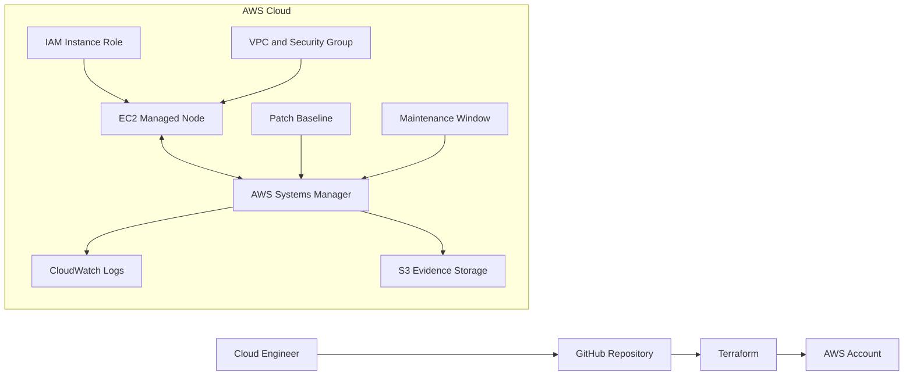

# Enterprise AWS Systems Manager Patch Management Lab

[](https://aws.amazon.com/systems-manager/)
[](https://developer.hashicorp.com/terraform)
[](#security-best-practices)
[](#training--mentorship)

> A beginner-friendly, hands-on implementation of enterprise patch management using AWS Systems Manager Patch Manager and Terraform.

---

## Table of Contents

- [Introduction](#introduction)
- [Project Overview](#project-overview)
- [Business Problem](#business-problem)
- [Solution](#solution)
- [Training & Mentorship](#training--mentorship)
- [AWS Services and Technologies Used](#aws-services-and-technologies-used)
- [Prerequisites](#prerequisites)
- [Architecture Overview](#architecture-overview)
- [Repository Structure](#repository-structure)
- [Deployment Steps](#deployment-steps)
- [Validation and Testing](#validation-and-testing)
- [Screenshots](#screenshots)
- [Security Best Practices](#security-best-practices)
- [Troubleshooting](#troubleshooting)
- [Cleanup](#cleanup)
- [Interview Questions and Answers](#interview-questions-and-answers)
- [Future Improvements](#future-improvements)
- [Key Lessons Learned](#key-lessons-learned)
- [Acknowledgments](#acknowledgments)

---

## Introduction

Operating systems must be updated regularly to fix security vulnerabilities, software defects, and reliability problems. Manually logging in to every server is slow, inconsistent, difficult to audit, and unsuitable for enterprise environments.

This project demonstrates how **AWS Systems Manager Patch Manager** can centrally scan and patch Amazon EC2 instances in a controlled, repeatable, and auditable manner. The infrastructure is defined with **Terraform**, allowing the environment to be version-controlled, reviewed, and recreated consistently.

The repository is intentionally written for beginners, recruiters, hiring managers, and students. It explains not only what was built, but also why enterprises use these methods.

### What I Learned

- Patch management is both a security responsibility and a business requirement.
- Automation reduces human error and configuration drift.
- Enterprise cloud projects require documentation, security, testing, and evidence.
- Technical work becomes more valuable when it can be explained clearly.

---

## Project Overview

This lab creates an EC2 instance that is managed through AWS Systems Manager instead of direct SSH administration. The instance receives an IAM role that allows the SSM Agent to register securely with AWS Systems Manager.

The project demonstrates:

- EC2 managed-node registration with AWS Systems Manager.
- IAM instance roles instead of hard-coded credentials.
- Tag-based patch groups.
- A custom patch baseline.
- Scheduled patch scans and installations using a maintenance window.
- Centralized compliance reporting.
- Repeatable deployment using Terraform.
- Beginner-friendly operational and interview documentation.

### Project Objectives

1. Deploy a secure EC2 instance with Terraform.
2. Register the instance as an SSM managed node.
3. Organize instances using patch-group tags.
4. Define approved patches through a patch baseline.
5. Schedule patching through a maintenance window.
6. Scan first, review compliance, and then install approved patches.
7. Document the implementation in a professional portfolio format.

### What I Learned

- An SSM managed node is a server that AWS Systems Manager can securely manage.
- Tags can control automation, not just identify resources.
- A patch baseline defines which updates are approved.
- A maintenance window controls when operational work is allowed to run.

---

## Business Problem

Organizations may operate hundreds or thousands of servers. Without centralized patch management, they face serious operational and security challenges.

| Challenge | Business Impact |
|---|---|
| Manual patching | High labor cost and inconsistent execution |
| Missing security updates | Increased vulnerability and breach risk |
| No approved schedule | Unexpected outages and user disruption |
| Limited reporting | Difficulty proving compliance to auditors |
| Direct SSH access | Larger attack surface and credential burden |
| Configuration drift | Servers become inconsistent over time |

Enterprise patching must balance four priorities:

- **Security:** Reduce exposure to known vulnerabilities.
- **Availability:** Avoid unnecessary business disruption.
- **Governance:** Follow approved schedules and change procedures.
- **Auditability:** Produce evidence showing what was scanned, installed, or failed.

### What I Learned

- Patch management is a risk-management process, not merely an update command.
- Security teams focus on vulnerability exposure, while operations teams focus on uptime.
- Enterprise solutions need both automation and evidence.

---

## Solution

This project uses AWS Systems Manager Patch Manager to create a structured patching workflow:

1. **Discover** EC2 instances through tags.
2. **Assess** patch status using a scan operation.
3. **Approve** updates through a patch baseline.
4. **Schedule** work through a maintenance window.
5. **Execute** patching through the SSM Agent.
6. **Report** compliance in a centralized AWS dashboard.
7. **Reproduce** the environment using Terraform.

The enterprise methodology is simple: start with visibility, test on a limited group, validate results, and then expand safely.

### What I Learned

- Scanning and installing are separate operations.
- Safe patching usually begins with development or test systems.
- Centralized compliance reporting gives security, operations, and audit teams shared evidence.

---

## Training & Mentorship

This project was completed through the **CloudGenius Cloud & Cybersecurity Training Program** under the mentorship of **Isaac Obaro, Founder & Principal Cloud Architect**.

The program prepares students for real enterprise cloud engineering and cloud security roles through practical, hands-on projects. This repository reflects that goal by combining technical implementation, infrastructure as code, security controls, operational validation, troubleshooting, professional communication, and interview preparation.

Learn more about CloudGenius:

- **Website:** `https://<cloudgenius-website-placeholder>`
- **GitHub Organization:** `https://github.com/<cloudgenius-github-placeholder>`
- **LinkedIn:** `https://www.linkedin.com/company/<cloudgenius-linkedin-placeholder>`

### What I Learned

- Mentorship connects individual AWS services to larger enterprise practices.
- Professional cloud work includes communication, security, testing, and operations.
- A strong portfolio project explains both what was built and why it matters.

---

## AWS Services and Technologies Used

### AWS Systems Manager

AWS Systems Manager is a centralized operations service for viewing, managing, automating, and securing cloud and hybrid resources.

In this project, it manages node registration, patch execution, command history, maintenance scheduling, and compliance reporting.

### Patch Manager

Patch Manager automates operating-system patch scanning and installation.

- **Scan:** Identifies missing patches without changing the server.
- **Install:** Applies approved patches and may reboot the server.

### Patch Baseline

A patch baseline defines which patches are approved or rejected. Approval rules can consider operating system, product, classification, severity, and the number of days since release.

### Maintenance Window

A maintenance window defines an approved period for operational tasks. It reduces the chance of patching during peak business hours.

### Amazon EC2

Amazon EC2 provides virtual servers in AWS. The EC2 instance in this lab represents an enterprise workload requiring routine patching.

### IAM

AWS Identity and Access Management controls access to AWS services. The EC2 instance uses an IAM role, allowing temporary credentials instead of stored access keys.

### SSM Agent

The SSM Agent runs on the managed instance. It receives authorized instructions from Systems Manager, performs tasks locally, and returns results.

### Amazon VPC

Amazon VPC provides an isolated network for AWS resources. Security groups act as virtual firewalls around EC2 instances.

### Amazon CloudWatch

CloudWatch collects logs, metrics, and events. In an enterprise design, patch command output and operational alerts should be centralized for monitoring and investigation.

### Amazon S3

Amazon S3 can securely store command output, reports, and long-term audit evidence.

### Terraform

Terraform is an infrastructure-as-code tool. Infrastructure is described in code instead of being created manually through the console.

Common Terraform commands:

```bash
terraform init
terraform fmt -recursive
terraform validate
terraform plan
terraform apply
terraform destroy
```

### What I Learned

- AWS services communicate through identities, APIs, tags, and policies.
- IAM roles are safer than hard-coded access keys.
- Terraform makes infrastructure repeatable and reviewable.
- Logging and compliance evidence are essential operational controls.

---

## Prerequisites

Before deploying, install and configure:

- An AWS account with permissions for EC2, IAM, VPC, and Systems Manager.
- AWS CLI version 2.
- Terraform.
- Git.
- An AWS CLI profile using secure credentials.
- A basic understanding of command-line navigation.
- Awareness of possible AWS charges.

Verify your tools and identity:

```bash
aws --version
terraform version
git --version
aws sts get-caller-identity
```

> Never commit AWS credentials, private keys, passwords, Terraform state files, or sensitive account information to GitHub.

### What I Learned

- Authentication should be verified before troubleshooting Terraform.
- Version checks prevent avoidable setup problems.
- Cost awareness is part of responsible cloud engineering.

---

## Architecture Overview



### Architecture Flow

1. Terraform authenticates to AWS through the configured AWS provider.
2. Terraform creates networking, IAM, EC2, and Systems Manager resources.
3. The EC2 instance starts with the SSM Agent available.
4. The IAM role allows the agent to register with Systems Manager.
5. Tags associate the instance with the patch group.
6. The maintenance window runs a scan or installation task.
7. Systems Manager records compliance information.
8. Logs and evidence can be sent to CloudWatch or S3.

### What I Learned

- Systems Manager removes the need for inbound SSH in many administration workflows.
- The instance still needs network access to AWS service endpoints.
- Architecture diagrams make complex systems easier to explain.

---

## Repository Structure

```text
cloudgenius-aws-ssm-patching-lab/
├── README.md
├── SECURITY.md
├── CONTRIBUTING.md
├── .gitignore
├── docs/
│   ├── architecture.md
│   └── screenshots/
│       └── README.md
└── terraform/
    ├── versions.tf
    ├── providers.tf
    ├── variables.tf
    ├── main.tf
    ├── outputs.tf
    └── terraform.tfvars.example
```

### What I Learned

- A predictable structure improves onboarding and peer review.
- Documentation and infrastructure code should be clearly separated.
- Example variable files help users without exposing real values.

---

## Deployment Steps

### 1. Clone the Repository

```bash
git clone https://github.com/kennethmbah/cloudgenius-aws-ssm-patching-lab.git
cd cloudgenius-aws-ssm-patching-lab/terraform
```

### 2. Review the Terraform Code

Review the region, instance type, AMI selection, tags, patch schedule, and security controls before deploying.

### 3. Create a Variable File

```bash
cp terraform.tfvars.example terraform.tfvars
```

Update the values for your environment. Do not place secrets in this file.

### 4. Initialize Terraform

```bash
terraform init
```

### 5. Format and Validate

```bash
terraform fmt -recursive
terraform validate
```

### 6. Create and Review a Plan

```bash
terraform plan -out=tfplan
```

A Terraform plan is a safety checkpoint. Review each proposed resource before applying it.

### 7. Apply the Plan

```bash
terraform apply tfplan
```

### 8. Confirm Managed-Node Registration

In the AWS Console:

1. Open **AWS Systems Manager**.
2. Open **Fleet Manager** or **Managed nodes**.
3. Confirm that the EC2 instance is online.
4. Verify its operating system, IAM role, and tags.

CLI example:

```bash
aws ssm describe-instance-information
```

### 9. Run a Patch Scan

Use the Systems Manager document:

```text
AWS-RunPatchBaseline
```

Set the operation to:

```text
Scan
```

### 10. Review Compliance

Review missing, installed, failed, and noncompliant patches in Systems Manager.

### 11. Install Approved Patches

After confirming backups, approvals, and the maintenance period, run the same document with:

```text
Install
```

Choose reboot behavior based on workload requirements.

### What I Learned

- `terraform plan` provides an important review step.
- Managed-node registration should be confirmed before patch troubleshooting.
- Scanning before installation reduces operational risk.
- Production patching requires backups, communication, approvals, and rollback planning.

---

## Validation and Testing

A successful implementation should demonstrate:

- The EC2 instance appears online in Systems Manager.
- The IAM instance profile is attached correctly.
- No inbound SSH rule is required for routine administration.
- Patch-group tags match the baseline registration.
- The scan command completes successfully.
- Compliance data appears in Systems Manager.
- Approved patches install during the maintenance window.
- Reboot behavior matches the chosen policy.
- Terraform can recreate the environment consistently.

Recommended evidence:

- Sanitized Terraform plan output.
- SSM managed-node status.
- Patch baseline configuration.
- Maintenance-window schedule.
- Patch compliance results.
- Successful scan and installation command output.
- Centralized log evidence.

### What I Learned

- Deployment is not complete until it has been tested.
- Evidence should prove both configuration and operational behavior.
- Screenshots must hide sensitive account and network information.

---

## Screenshots

Add sanitized screenshots to `docs/screenshots/`.

| Screenshot | Purpose | Suggested File |
|---|---|---|
| Terraform initialization | Shows provider setup | `01-terraform-init.png` |
| Terraform plan | Shows planned resources | `02-terraform-plan.png` |
| SSM managed node | Confirms registration | `03-managed-node.png` |
| Patch baseline | Shows approval rules | `04-patch-baseline.png` |
| Maintenance window | Shows scheduling | `05-maintenance-window.png` |
| Patch scan | Shows assessment | `06-patch-scan.png` |
| Compliance dashboard | Shows reporting | `07-compliance-dashboard.png` |
| Patch installation | Shows successful execution | `08-patch-install.png` |

Example:

```markdown

```

### What I Learned

- Good screenshots tell a technical story.
- Sensitive information must be redacted before publishing.
- Captions should explain why each image matters.

---

## Security Best Practices

### Identity and Access

- Use IAM roles instead of long-lived access keys.
- Apply least privilege.
- Enable multi-factor authentication for human users.
- Prefer temporary credentials through IAM Identity Center or role assumption.

### Network Security

- Avoid inbound SSH or RDP unless there is a documented requirement.
- Prefer Session Manager for administrative access.
- Use private subnets where appropriate.
- Use VPC endpoints for SSM services in restricted networks.
- Restrict outbound access according to organizational policy.

### Patch Governance

- Separate development, test, and production patch groups.
- Scan before installing.
- Use change-management approval for production.
- Define reboot behavior intentionally.
- Maintain backups, rollback procedures, and exception records.
- Investigate missing and failed patches promptly.

### Logging and Monitoring

- Send command and session logs to CloudWatch or encrypted S3.
- Enable CloudTrail for API auditing.
- Alert on failed patch operations and noncompliant nodes.
- Define secure log retention periods.

### Terraform Security

- Never commit `.tfstate`, `.tfvars`, credentials, or private keys.
- Use encrypted remote state and locking in team environments.
- Pin Terraform and provider versions.
- Run formatting, validation, linting, and security scans in CI.
- Review plans before applying changes.
- Separate environments and deployment roles.

### Data Protection

- Encrypt EBS volumes.
- Encrypt S3 buckets and logs.
- Block public access to evidence buckets.
- Redact sensitive information from screenshots.

### What I Learned

- Removing inbound administration ports reduces attack surface.
- Patch automation must be protected by strong IAM controls.
- Security includes prevention, detection, evidence, and recovery.
- Terraform state can contain sensitive infrastructure information.

---

## Troubleshooting

### Instance Does Not Appear in Systems Manager

Check that:

- The instance is running.
- The SSM Agent is installed and active.
- The IAM instance profile is attached.
- The role includes `AmazonSSMManagedInstanceCore` or equivalent permissions.
- The instance can reach Systems Manager endpoints through internet access, NAT, or VPC endpoints.
- The system clock is accurate.

Linux commands:

```bash
sudo systemctl status amazon-ssm-agent
sudo systemctl restart amazon-ssm-agent
sudo journalctl -u amazon-ssm-agent --no-pager | tail -n 100
```

### Patch Task Does Not Target the Instance

Check:

- Tag key and value spelling.
- Patch-group registration.
- Maintenance-window target configuration.
- Operating-system compatibility.
- Patch baseline association.

### Patch Operation Fails

Check:

- Available disk space.
- Package-manager locks.
- Repository reachability.
- Reboot requirements.
- SSM command output.
- Operating-system logs.

### Terraform Authentication Error

```bash
aws sts get-caller-identity
```

Confirm that the correct AWS profile and region are active.

### Terraform State or Lock Error

Do not manually remove a state lock until you confirm that no other deployment is running.

### What I Learned

- Troubleshooting should move through identity, network, agent, targeting, operating system, and logs.
- Error messages are evidence and should be preserved.
- Most SSM registration problems involve IAM, agent health, or network reachability.

---

## Cleanup

To avoid unnecessary charges:

```bash
cd terraform
terraform plan -destroy
terraform destroy
```

After destruction, verify that the following have been removed where applicable:

- EC2 instances and EBS volumes.
- Elastic IP addresses.
- NAT gateways.
- CloudWatch log groups.
- S3 evidence buckets.
- Lab-specific IAM roles and policies.
- Systems Manager maintenance windows and registrations.

> Production cleanup must follow retention, audit, legal, backup, and change-management requirements.

### What I Learned

- Cloud resources may continue generating costs after a lab is complete.
- Terraform destruction should be reviewed like any other change.
- Some production data should be protected from automatic deletion.

---

## Interview Questions and Answers

### 1. What problem does Patch Manager solve?

It centrally scans and installs operating-system patches across managed servers, reducing manual effort and improving consistency and compliance reporting.

### 2. What is an SSM managed node?

A managed node is a machine registered with AWS Systems Manager. It can be an EC2 instance, an on-premises server, or a virtual machine in another cloud.

### 3. What does the SSM Agent do?

It runs on the server, receives authorized tasks, performs them locally, and sends status and output back to Systems Manager.

### 4. Why use an IAM instance role?

It provides temporary AWS credentials to the EC2 instance without storing permanent access keys on the server.

### 5. What is a patch baseline?

A patch baseline defines which patches are approved or rejected using rules such as severity, classification, product, and approval delay.

### 6. What is a patch group?

A patch group is a logical collection of managed nodes identified by tags. Different groups may use different patch policies and schedules.

### 7. What is the difference between Scan and Install?

Scan reports patch compliance without changing the server. Install applies approved patches and may reboot the server.

### 8. Why use a maintenance window?

It ensures operational work runs during an approved time and reduces business disruption.

### 9. Can Systems Manager work without inbound SSH?

Yes. The SSM Agent initiates outbound communication to AWS service endpoints, allowing management without opening port 22.

### 10. How would you patch production safely?

I would use staged patch groups, test first, review scan results, verify backups, obtain change approval, schedule a maintenance window, monitor execution, validate the application, and document the outcome.

### 11. Why use Terraform?

Terraform makes infrastructure repeatable, version-controlled, reviewable, and less dependent on manual console actions.

### 12. How do you protect Terraform state?

Use encrypted remote state, access controls, versioning, state locking, and restricted deployment roles. Never commit state to GitHub.

### 13. What happens if an instance is offline during patching?

It may miss the task and remain noncompliant. An enterprise process should identify missed systems and provide a remediation window.

### 14. How do you prove compliance?

Use Systems Manager compliance reports, command history, CloudTrail, CloudWatch logs, S3 evidence, change tickets, and documented validation results.

### 15. What would you improve for enterprise production use?

I would add multi-account management, private VPC endpoints, encrypted centralized logs, alerts, staged patch rings, CI security checks, health validation, and dashboard reporting.

### What I Learned

- Strong interview answers connect technical controls to business risk and reliability.
- Enterprise patching is a controlled lifecycle, not a single command.
- Explaining why a design was chosen is as important as explaining how it works.

---

## Future Improvements

- Separate development, staging, and production patch rings.
- Add AWS Organizations and multi-account deployment.
- Add Systems Manager Quick Setup.
- Add private VPC endpoints for Systems Manager services.
- Store logs in encrypted S3 with lifecycle controls.
- Send failure alerts through Amazon SNS.
- Build CloudWatch compliance dashboards.
- Integrate compliance findings with Security Hub or a SIEM.
- Verify backups automatically before patching.
- Add post-reboot application health checks.
- Use encrypted remote Terraform state with locking.
- Add CI checks using Terraform validation, TFLint, Checkov, or Trivy.
- Add policy-as-code guardrails.
- Add Windows patching examples.
- Document rollback and exception-management procedures.

### What I Learned

- Enterprise maturity grows through automation, governance, observability, resilience, and scale.
- A lab can demonstrate a solid foundation while clearly identifying production enhancements.

---

## Key Lessons Learned

- Patch management reduces exposure to known vulnerabilities.
- AWS Systems Manager enables centralized administration without direct SSH.
- IAM roles provide secure temporary access for workloads.
- Tags make automation scalable.
- Patch baselines provide policy control.
- Maintenance windows reduce operational disruption.
- Terraform improves repeatability and peer review.
- Compliance evidence is as important as technical execution.
- Security and operations must be designed together.
- Clear documentation helps recruiters, hiring managers, engineers, auditors, and students understand the project.

---

## Acknowledgments

Special thanks to **Isaac Obaro, Founder & Principal Cloud Architect**, for mentorship and practical guidance through the **CloudGenius Cloud & Cybersecurity Training Program**.

This project represents hands-on learning intended to prepare students for real cloud engineering and cloud security responsibilities. It follows AWS and Terraform best practices, reflects enterprise methodologies, and remains accessible to beginners.

---

## Disclaimer

This repository is an educational project. Review all infrastructure, security, cost, compliance, and operational requirements before using any component in production. AWS services, features, and pricing may change over time.
