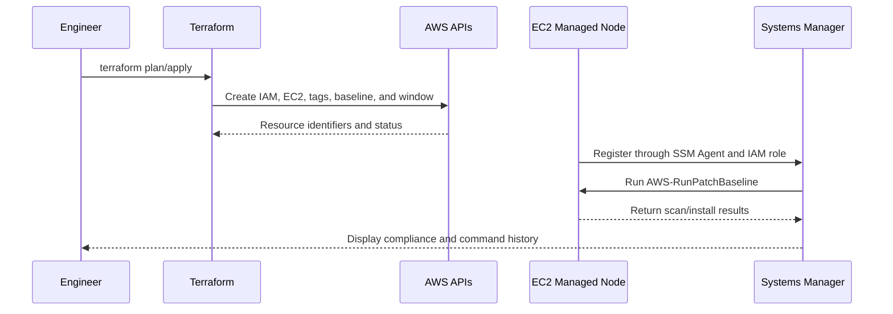

# Architecture Notes

## Design Goal

The design demonstrates a secure and repeatable method for managing operating-system patches on an Amazon EC2 instance through AWS Systems Manager.

## Main Components

### Cloud Engineer Workstation

The engineer uses Git, Terraform, and the AWS CLI. Authentication should use temporary credentials rather than permanent keys.

### Terraform

Terraform creates and connects the AWS resources. It provides a reviewable plan before changes are applied and helps keep environments consistent.

### IAM Instance Profile

The EC2 instance receives an IAM role with the AWS-managed `AmazonSSMManagedInstanceCore` policy. The role allows the SSM Agent to communicate with Systems Manager without storing AWS credentials on the server.

### EC2 Managed Node

The EC2 instance represents a Linux workload. It is tagged with an environment and patch-group value so Systems Manager can target it through policy instead of by manually selecting one instance.

### Security Group

The example security group has no inbound rules. Routine administration is expected to use Systems Manager rather than SSH. Outbound access is required so the instance can reach operating-system repositories and AWS service endpoints.

### Patch Baseline

The baseline defines patch approval rules. In production, organizations normally create different policies for development, staging, and production systems.

### Maintenance Window

The maintenance window defines when patch scans or installations may run. A scheduled window helps coordinate patching with business and application owners.

## Data and Control Flow

## Enterprise Considerations

A production implementation should also consider:

- Private subnets and VPC endpoints.
- Multi-account and multi-region governance.
- Remote encrypted Terraform state with locking.
- Centralized CloudWatch and S3 logging.
- Amazon SNS alerts for failure or noncompliance.
- Patch rings and approval gates.
- Backups and application health checks.
- Formal rollback and exception procedures.
- CloudTrail, Security Hub, and SIEM integration.

## What I Learned

- Secure management depends on IAM, networking, agents, and service configuration working together.
- Tag-based targeting is easier to scale than managing instance IDs manually.
- Enterprise architecture must include monitoring, recovery, governance, and evidence.
